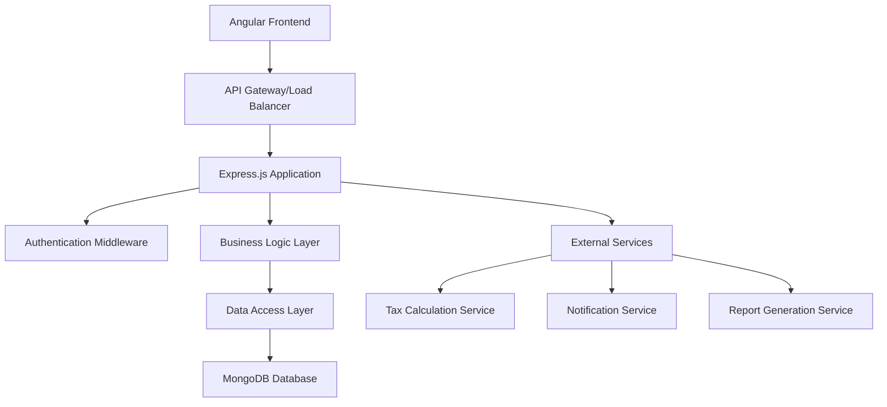

# Design Document

## Overview

The Indus Traders backend is designed as a RESTful API service built with Node.js and Express.js, using MongoDB as the primary database. The architecture follows a layered approach with clear separation of concerns, implementing domain-driven design principles for the complex business logic of invoice management, inventory tracking, and financial operations.

The system is designed to handle Pakistani business requirements including GST/WHT tax calculations, multi-currency support, and compliance with SRB/FBR regulations. The API serves an Angular frontend and supports real-time operations with high performance and scalability.

## Architecture

### High-Level Architecture



### Layered Architecture

1. **Presentation Layer**: Express.js routes and controllers
2. **Business Logic Layer**: Services and domain models
3. **Data Access Layer**: Repositories and MongoDB ODM (Mongoose)
4. **Infrastructure Layer**: External services, utilities, and configurations

### Microservices Consideration

While initially built as a monolith, the system is designed with clear module boundaries to allow future microservices extraction:
- Invoice Service (Sales/Purchase)
- Inventory Service
- Accounts Service
- Tax Service
- Reporting Service

## Components and Interfaces

### Core Modules

#### 1. Authentication Module
- **JWT Service**: Token generation, validation, and refresh
- **User Service**: User management and role-based access control
- **Auth Middleware**: Request authentication and authorization

#### 2. Invoice Module
- **Sales Invoice Service**: Sales transaction processing
- **Purchase Invoice Service**: Purchase transaction processing
- **Invoice Number Generator**: Unique sequential numbering
- **Tax Calculator**: GST/WHT calculations

#### 3. Inventory Module
- **Item Service**: Product catalog management
- **Stock Service**: Inventory level tracking
- **Batch Service**: Batch and expiry date management
- **Stock Movement Service**: Transaction history tracking

#### 4. Accounts Module
- **Customer Service**: Customer account management
- **Supplier Service**: Supplier account management
- **Ledger Service**: General ledger operations
- **Credit Management**: Credit limit enforcement

#### 5. Cash Book Module
- **Cash Receipt Service**: Cash collection processing
- **Cash Payment Service**: Cash disbursement processing
- **Bank Reconciliation Service**: Bank statement matching

#### 6. Tax Module
- **Tax Configuration Service**: Tax rate management
- **Tax Calculation Engine**: Multi-tax computation
- **Tax Report Generator**: Compliance reporting

#### 7. Reporting Module
- **Report Engine**: Dynamic report generation
- **Export Service**: PDF/Excel/CSV export
- **Analytics Service**: Business intelligence queries

### API Design Patterns

#### RESTful Endpoints Structure
```
/api/v1/auth/*           - Authentication endpoints
/api/v1/invoices/*       - Invoice management
/api/v1/inventory/*      - Inventory operations
/api/v1/accounts/*       - Account management
/api/v1/cashbook/*       - Cash operations
/api/v1/taxes/*          - Tax management
/api/v1/reports/*        - Reporting endpoints
```

#### Standard Response Format
```json
{
  "success": true,
  "data": {},
  "message": "Operation completed successfully",
  "pagination": {
    "page": 1,
    "limit": 20,
    "total": 100,
    "pages": 5
  },
  "timestamp": "2024-01-01T00:00:00Z"
}
```

#### Error Response Format
```json
{
  "success": false,
  "error": {
    "code": "VALIDATION_ERROR",
    "message": "Invalid input data",
    "details": [
      {
        "field": "email",
        "message": "Invalid email format"
      }
    ]
  },
  "timestamp": "2024-01-01T00:00:00Z"
}
```

## Data Models

### Core Entities

#### User Schema
```javascript
{
  _id: ObjectId,
  username: String,
  email: String,
  password: String, // hashed
  role: String, // enum: admin, sales, purchase, inventory, accountant, data_entry
  isActive: Boolean,
  lastLogin: Date,
  createdAt: Date,
  updatedAt: Date
}
```

#### Customer/Supplier Schema
```javascript
{
  _id: ObjectId,
  code: String, // unique identifier
  name: String,
  type: String, // customer, supplier, both
  contactInfo: {
    phone: String,
    email: String,
    address: String,
    city: String,
    country: String
  },
  financialInfo: {
    creditLimit: Number,
    paymentTerms: Number, // days
    taxNumber: String,
    currency: String
  },
  isActive: Boolean,
  createdAt: Date,
  updatedAt: Date
}
```

#### Item Schema
```javascript
{
  _id: ObjectId,
  code: String, // unique SKU
  name: String,
  description: String,
  category: String,
  unit: String, // piece, kg, liter, etc.
  pricing: {
    costPrice: Number,
    salePrice: Number,
    currency: String
  },
  tax: {
    gstRate: Number,
    whtRate: Number,
    taxCategory: String
  },
  inventory: {
    currentStock: Number,
    minimumStock: Number,
    maximumStock: Number
  },
  isActive: Boolean,
  createdAt: Date,
  updatedAt: Date
}
```

#### Invoice Schema
```javascript
{
  _id: ObjectId,
  invoiceNumber: String, // auto-generated
  type: String, // sales, purchase
  customerId: ObjectId, // ref to Customer
  supplierId: ObjectId, // ref to Supplier
  invoiceDate: Date,
  dueDate: Date,
  items: [{
    itemId: ObjectId,
    quantity: Number,
    unitPrice: Number,
    discount: Number,
    taxAmount: Number,
    lineTotal: Number,
    batchInfo: {
      batchNumber: String,
      expiryDate: Date,
      manufacturingDate: Date
    }
  }],
  totals: {
    subtotal: Number,
    totalDiscount: Number,
    totalTax: Number,
    grandTotal: Number
  },
  status: String, // draft, confirmed, paid, cancelled
  paymentStatus: String, // pending, partial, paid
  notes: String,
  createdBy: ObjectId,
  createdAt: Date,
  updatedAt: Date
}
```

#### Stock Movement Schema
```javascript
{
  _id: ObjectId,
  itemId: ObjectId,
  movementType: String, // in, out, adjustment
  quantity: Number,
  referenceType: String, // sales_invoice, purchase_invoice, adjustment
  referenceId: ObjectId,
  batchInfo: {
    batchNumber: String,
    expiryDate: Date
  },
  movementDate: Date,
  notes: String,
  createdBy: ObjectId,
  createdAt: Date
}
```

#### Ledger Entry Schema
```javascript
{
  _id: ObjectId,
  accountId: ObjectId,
  transactionType: String, // debit, credit
  amount: Number,
  description: String,
  referenceType: String, // invoice, payment, adjustment
  referenceId: ObjectId,
  transactionDate: Date,
  createdBy: ObjectId,
  createdAt: Date
}
```

### Database Relationships

- **One-to-Many**: Customer → Invoices, Item → Stock Movements
- **Many-to-Many**: Invoice ↔ Items (through invoice items array)
- **Reference**: All entities reference User for audit trails

### Indexing Strategy

```javascript
// Performance-critical indexes
db.invoices.createIndex({ "invoiceNumber": 1 }, { unique: true })
db.invoices.createIndex({ "customerId": 1, "invoiceDate": -1 })
db.items.createIndex({ "code": 1 }, { unique: true })
db.stockMovements.createIndex({ "itemId": 1, "movementDate": -1 })
db.ledgerEntries.createIndex({ "accountId": 1, "transactionDate": -1 })
```

## Error Handling

### Error Classification

1. **Validation Errors** (400): Invalid input data
2. **Authentication Errors** (401): Invalid credentials
3. **Authorization Errors** (403): Insufficient permissions
4. **Not Found Errors** (404): Resource not found
5. **Business Logic Errors** (422): Business rule violations
6. **Server Errors** (500): Internal system errors

### Error Handling Middleware

```javascript
// Global error handler
app.use((error, req, res, next) => {
  const errorResponse = {
    success: false,
    error: {
      code: error.code || 'INTERNAL_ERROR',
      message: error.message || 'Internal server error',
      details: error.details || []
    },
    timestamp: new Date().toISOString()
  };
  
  // Log error for monitoring
  logger.error(error);
  
  res.status(error.statusCode || 500).json(errorResponse);
});
```

### Business Rule Validation

- **Credit Limit Validation**: Prevent sales exceeding customer credit limits
- **Stock Validation**: Prevent negative inventory
- **Tax Compliance**: Ensure proper tax calculations
- **Date Validation**: Prevent backdated transactions beyond allowed period

## Testing Strategy

### Testing Pyramid

1. **Unit Tests** (70%): Individual functions and methods
2. **Integration Tests** (20%): API endpoints and database operations
3. **End-to-End Tests** (10%): Complete business workflows

### Testing Tools and Frameworks

- **Jest**: Unit and integration testing
- **Supertest**: API endpoint testing
- **MongoDB Memory Server**: In-memory database for testing
- **Factory Pattern**: Test data generation

### Test Categories

#### Unit Tests
- Service layer business logic
- Utility functions (tax calculations, date formatting)
- Validation functions
- Data transformation functions

#### Integration Tests
- API endpoint functionality
- Database operations
- Authentication middleware
- Error handling

#### Performance Tests
- API response times
- Database query performance
- Concurrent user handling
- Memory usage optimization

### Test Data Management

```javascript
// Test factories for consistent test data
const InvoiceFactory = {
  create: (overrides = {}) => ({
    customerId: new ObjectId(),
    invoiceDate: new Date(),
    items: [ItemFactory.create()],
    ...overrides
  })
};
```

### Continuous Integration

- **Pre-commit Hooks**: Code linting and basic tests
- **CI Pipeline**: Full test suite execution
- **Code Coverage**: Minimum 80% coverage requirement
- **Quality Gates**: ESLint, security scanning, dependency checks

This design provides a robust foundation for the Indus Traders backend system, ensuring scalability, maintainability, and compliance with business requirements while following Node.js and MongoDB best practices.