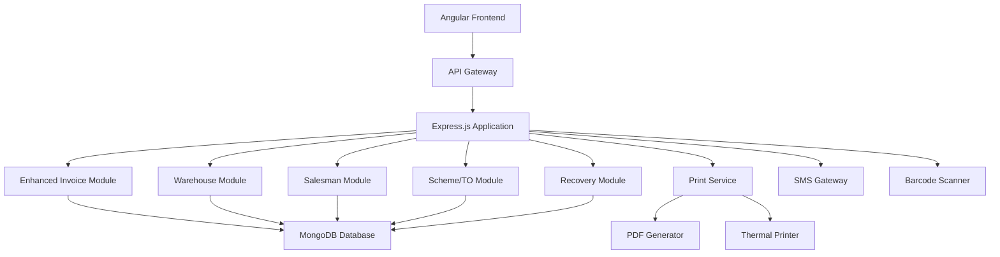
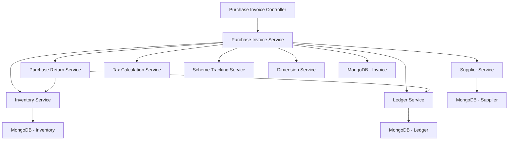
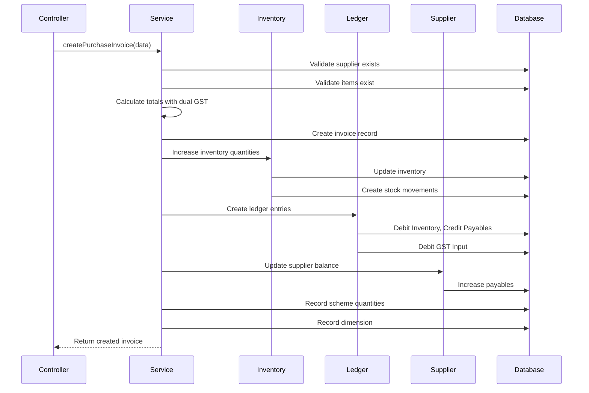
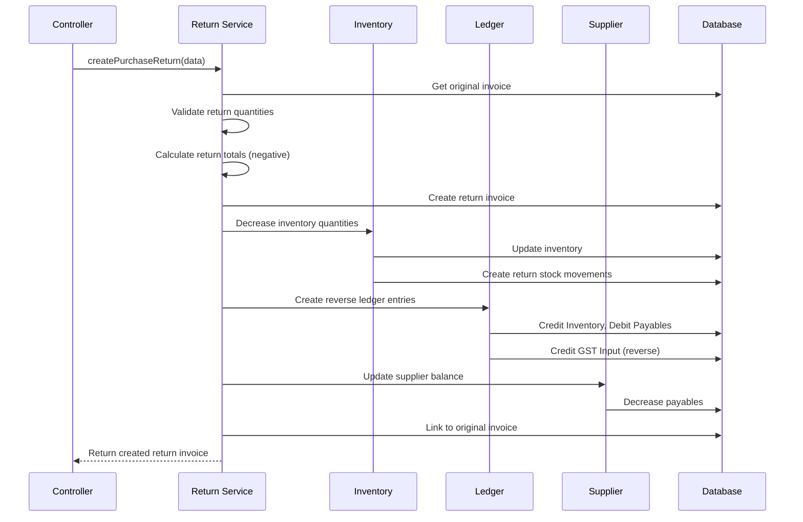

# Design Document - Phase 2 Enhancements

## Overview

Phase 2 enhances the Indus Traders backend with advanced features including sales/purchase returns, multi-warehouse management, scheme/bonus tracking, trade offers, post-dated cheque management, salesman management, route planning, cash recovery tracking, and multiple print formats. This design builds upon the existing Phase 1 architecture while maintaining backward compatibility.

## Architecture Enhancements

### High-Level Architecture Updates



### New Modules

1. **Return Invoice Module**: Handles sales and purchase returns
2. **Warehouse Module**: Multi-warehouse inventory management
3. **Salesman Module**: Salesman management and route planning
4. **Scheme/TO Module**: Scheme, bonus, and trade offer management
5. **Recovery Module**: Cash recovery tracking and summaries
6. **Print Service Module**: Multiple print format generation
7. **Cheque Module**: Post-dated cheque management
8. **Route Module**: Route planning and assignment
9. **Quotation History Module**: Price history tracking
10. **SMS Module**: SMS messaging integration

## Requirement 2: Enhanced Purchase Invoice System with Returns - Detailed Design

### Overview

The Enhanced Purchase Invoice System extends the existing purchase invoice functionality to support purchase returns, dual GST rates (18% and 4%), scheme tracking, supplier bill numbers, dimension tracking, and warranty information. This design ensures proper inventory reversal, payables management, and comprehensive purchase transaction tracking.

### Architecture Components



### Data Model Extensions

#### Enhanced Invoice Schema for Purchase

````javascript
// Extension to existing Invoice model
const purchaseInvoiceExtensions = {
  // Invoice Type Enhancement
  type: {
    type: String,
    required: true,
    enum: ['sales', 'purchase', 'return_sales', 'return_purchase'],
  },

  // Purchase-specific fields
  supplierBillNo: {
    type: String,
    trim: true,
    maxlength: 100,
    required() {
      return this.type === 'purchase' || this.type === 'return_purchase';
    },
  },

  // Return invoice reference
  originalInvoiceId: {
    type: mongoose.Schema.Types.ObjectId,
    ref: 'Invoice',
    required() {
      return this.type === 'return_purchase';
    },
  },

  // Dimension tracking (project/cost center)
  dimension: {
    type: String,
    trim: true,
    maxlength: 100,
  },

  // Warranty information
  warrantyInfo: {
    type: String,
    trim: true,
    maxlength: 500,
  },

  // Return metadata
  returnMetadata: {
    returnReason: {
      type: String,
      enum: ['damaged', 'expired', 'wrong_item', 'quality_issue', 'other'],
    },
    returnNotes: String,
    returnDate: Date,
  },
};

##
## Enhanced Invoice Item Schema for Purchase

```javascript
const purchaseInvoiceItemExtensions = {
  // Dual GST rate support
  gstRate: {
    type: Number,
    enum: [4, 18],
    default: 18,
    required: true,
  },

  gstAmount: {
    type: Number,
    default: 0,
    min: 0,
  },

  // Scheme tracking
  schemeQuantity: {
    type: Number,
    default: 0,
    min: 0,
  },

  // Dimension per line item
  dimension: {
    type: String,
    trim: true,
    maxlength: 100,
  },

  // Warranty per item
  warrantyMonths: {
    type: Number,
    min: 0,
    default: 0,
  },

  warrantyDetails: {
    type: String,
    trim: true,
    maxlength: 200,
  },
};
````

### API Endpoints

#### Purchase Invoice Endpoints

```
POST   /api/purchase-invoices              - Create new purchase invoice
POST   /api/purchase-invoices/return       - Create purchase return invoice
GET    /api/purchase-invoices              - List all purchase invoices
GET    /api/purchase-invoices/:id          - Get purchase invoice details
PUT    /api/purchase-invoices/:id          - Update purchase invoice
DELETE /api/purchase-invoices/:id          - Delete purchase invoice (soft delete)
GET    /api/purchase-invoices/:id/returnable - Get returnable items from invoice
POST   /api/purchase-invoices/:id/validate-return - Validate return quantities
```

### Component Design

#### 1. Purchase Invoice Controller

**Responsibilities:**

- Handle HTTP requests for purchase invoice operations
- Validate request data
- Coordinate with service layer
- Return appropriate responses

**Key Methods:**

```javascript
class PurchaseInvoiceController {
  // Create new purchase invoice
  async createPurchaseInvoice(req, res, next) {
    // Validate invoice type (purchase)
    // Extract invoice data from request
    // Call service to create invoice
    // Return created invoice with 201 status
  }

  // Create purchase return invoice
  async createPurchaseReturn(req, res, next) {
    // Validate original invoice exists
    // Validate return quantities
    // Call service to create return invoice
    // Return created return invoice
  }

  // Get returnable items from invoice
  async getReturnableItems(req, res, next) {
    // Get original invoice
    // Calculate already returned quantities
    // Return available quantities for return
  }

  // Validate return request
  async validateReturn(req, res, next) {
    // Validate return quantities don't exceed original
    // Check if items are still in inventory
    // Return validation result
  }
}
```

#### 2. Purchase Invoice Service

**Responsibilities:**

- Business logic for purchase invoice operations
- Coordinate with inventory, ledger, and supplier services
- Handle GST calculations with dual rates
- Manage scheme tracking
- Process dimension information

**Key Methods:**

```javascript
class PurchaseInvoiceService {
  // Create purchase invoice
  async createPurchaseInvoice(invoiceData, userId) {
    // 1. Validate supplier exists
    // 2. Validate items and quantities
    // 3. Calculate totals with dual GST rates
    // 4. Create invoice record
    // 5. Update inventory (increase stock)
    // 6. Create ledger entries (debit inventory, credit payables)
    // 7. Update supplier balance
    // 8. Track scheme quantities separately
    // 9. Record dimension information
    // 10. Return created invoice
  }

  // Calculate invoice totals with dual GST
  calculatePurchaseInvoiceTotals(items) {
    // For each item:
    //   - Calculate line subtotal (qty × price)
    //   - Apply discount
    //   - Calculate GST (18% or 4% based on item)
    //   - Calculate line total
    // Sum all line totals
    // Return totals object
  }

  // Get returnable items
  async getReturnableItems(invoiceId) {
    // Get original invoice
    // Get all return invoices for this invoice
    // Calculate returned quantities per item
    // Return available quantities
  }

  // Validate return quantities
  async validateReturnQuantities(invoiceId, returnItems) {
    // Get returnable items
    // For each return item:
    //   - Check quantity doesn't exceed available
    //   - Validate item exists in original invoice
    // Return validation result
  }
}
```

#### 3. Purchase Return Service

**Responsibilities:**

- Handle purchase return logic
- Reverse inventory transactions
- Reverse ledger entries
- Update supplier payables

**Key Methods:**

```javascript
class PurchaseReturnService {
  // Create purchase return
  async createPurchaseReturn(returnData, userId) {
    // 1. Validate original invoice exists
    // 2. Validate return quantities
    // 3. Calculate return totals (negative amounts)
    // 4. Create return invoice record
    // 5. Reverse inventory (decrease stock)
    // 6. Create reverse ledger entries (credit inventory, debit payables)
    // 7. Update supplier balance (reduce payables)
    // 8. Link to original invoice
    // 9. Return created return invoice
  }

  // Reverse inventory for return
  async reverseInventory(returnItems) {
    // For each item:
    //   - Decrease inventory quantity
    //   - Create stock movement record (type: 'return_to_supplier')
    //   - Update batch quantities if applicable
  }

  // Create reverse ledger entries
  async createReverseLedgerEntries(returnInvoice) {
    // Create entries:
    //   - Credit: Inventory Account (reduce asset)
    //   - Debit: Accounts Payable (reduce liability)
    //   - Credit: GST Input (reverse tax credit)
  }
}
```

#### 4. Tax Calculation Service Enhancement

**Responsibilities:**

- Calculate GST at different rates (18% and 4%)
- Handle mixed GST rates in single invoice
- Generate tax reports

**Key Methods:**

```javascript
class TaxCalculationService {
  // Calculate GST for purchase item
  calculatePurchaseGST(amount, gstRate) {
    // Validate GST rate (4% or 18%)
    // Calculate GST amount
    // Return GST details
  }

  // Calculate invoice tax totals
  calculateInvoiceTaxTotals(items) {
    // Group items by GST rate
    // Calculate GST for each group
    // Return breakdown by rate
    // {
    //   gst18: { taxableAmount, gstAmount },
    //   gst4: { taxableAmount, gstAmount },
    //   total: totalGstAmount
    // }
  }
}
```

#### 5. Scheme Tracking Service

**Responsibilities:**

- Track scheme quantities separately from regular purchases
- Maintain scheme history
- Generate scheme reports

**Key Methods:**

```javascript
class SchemeTrackingService {
  // Record scheme quantities
  async recordSchemeQuantities(invoiceId, schemeItems) {
    // For each item with scheme:
    //   - Record scheme quantity
    //   - Link to invoice
    //   - Track scheme type
  }

  // Get scheme summary for supplier
  async getSupplierSchemesSummary(supplierId, dateRange) {
    // Get all invoices with schemes
    // Aggregate scheme quantities
    // Return summary
  }
}
```

### Business Logic

#### Purchase Invoice Creation Flow



#### Purchase Return Flow



### Calculation Logic

#### Dual GST Rate Calculation

```javascript
// Example calculation for purchase invoice with mixed GST rates
function calculatePurchaseInvoiceTotals(items) {
  let subtotal = 0;
  let totalDiscount = 0;
  let gst18Total = 0;
  let gst4Total = 0;

  items.forEach((item) => {
    // Calculate line subtotal
    const lineSubtotal = item.quantity * item.unitPrice;

    // Apply discount
    const discountAmount = (lineSubtotal * item.discount) / 100;
    const taxableAmount = lineSubtotal - discountAmount;

    // Calculate GST based on rate
    let gstAmount = 0;
    if (item.gstRate === 18) {
      gstAmount = (taxableAmount * 18) / 100;
      gst18Total += gstAmount;
    } else if (item.gstRate === 4) {
      gstAmount = (taxableAmount * 4) / 100;
      gst4Total += gstAmount;
    }

    // Update item totals
    item.gstAmount = gstAmount;
    item.lineTotal = taxableAmount + gstAmount;

    subtotal += lineSubtotal;
    totalDiscount += discountAmount;
  });

  return {
    subtotal,
    totalDiscount,
    gst18: gst18Total,
    gst4: gst4Total,
    totalTax: gst18Total + gst4Total,
    grandTotal: subtotal - totalDiscount + gst18Total + gst4Total,
  };
}
```

#### Return Quantity Validation

```javascript
// Validate return quantities don't exceed available
async function validateReturnQuantities(originalInvoiceId, returnItems) {
  // Get original invoice
  const originalInvoice = await Invoice.findById(originalInvoiceId);

  // Get all existing returns for this invoice
  const existingReturns = await Invoice.find({
    originalInvoiceId: originalInvoiceId,
    type: "return_purchase",
  });

  // Calculate already returned quantities
  const returnedQuantities = {};
  existingReturns.forEach((returnInvoice) => {
    returnInvoice.items.forEach((item) => {
      const itemId = item.itemId.toString();
      returnedQuantities[itemId] =
        (returnedQuantities[itemId] || 0) + item.quantity;
    });
  });

  // Validate each return item
  const errors = [];
  returnItems.forEach((returnItem) => {
    const originalItem = originalInvoice.items.find(
      (i) => i.itemId.toString() === returnItem.itemId.toString()
    );

    if (!originalItem) {
      errors.push(`Item ${returnItem.itemId} not found in original invoice`);
      return;
    }

    const alreadyReturned =
      returnedQuantities[returnItem.itemId.toString()] || 0;
    const availableForReturn = originalItem.quantity - alreadyReturned;

    if (returnItem.quantity > availableForReturn) {
      errors.push(
        `Return quantity ${returnItem.quantity} exceeds available ${availableForReturn} for item ${returnItem.itemId}`
      );
    }
  });

  return {
    valid: errors.length === 0,
    errors,
  };
}
```

### Ledger Entry Patterns

#### Purchase Invoice Ledger Entries

```javascript
// When creating purchase invoice
const ledgerEntries = [
  {
    // Debit: Inventory (Asset increases)
    accountType: "Inventory",
    debit: invoiceTotals.subtotal - invoiceTotals.totalDiscount,
    credit: 0,
    description: `Purchase from ${supplier.name} - Invoice ${invoiceNumber}`,
  },
  {
    // Debit: GST Input (Asset - tax credit)
    accountType: "GST Input",
    debit: invoiceTotals.totalTax,
    credit: 0,
    description: `GST on purchase - Invoice ${invoiceNumber}`,
  },
  {
    // Credit: Accounts Payable (Liability increases)
    accountType: "Accounts Payable",
    accountId: supplierId,
    debit: 0,
    credit: invoiceTotals.grandTotal,
    description: `Purchase from ${supplier.name} - Invoice ${invoiceNumber}`,
  },
];
```

#### Purchase Return Ledger Entries

```javascript
// When creating purchase return
const reverseLedgerEntries = [
  {
    // Credit: Inventory (Asset decreases)
    accountType: "Inventory",
    debit: 0,
    credit: returnTotals.subtotal - returnTotals.totalDiscount,
    description: `Return to ${supplier.name} - Return Invoice ${returnInvoiceNumber}`,
  },
  {
    // Credit: GST Input (Reverse tax credit)
    accountType: "GST Input",
    debit: 0,
    credit: returnTotals.totalTax,
    description: `GST reversal on return - Invoice ${returnInvoiceNumber}`,
  },
  {
    // Debit: Accounts Payable (Liability decreases)
    accountType: "Accounts Payable",
    accountId: supplierId,
    debit: returnTotals.grandTotal,
    credit: 0,
    description: `Return to ${supplier.name} - Return Invoice ${returnInvoiceNumber}`,
  },
];
```

### Inventory Management

#### Stock Movement for Purchase

```javascript
// Create stock movement for purchase
const stockMovement = {
  itemId: item.itemId,
  movementType: "purchase",
  quantity: item.quantity,
  referenceType: "Invoice",
  referenceId: invoiceId,
  date: invoiceDate,
  notes: `Purchase from ${supplier.name}`,
};
```

#### Stock Movement for Return

```javascript
// Create stock movement for return
const returnStockMovement = {
  itemId: item.itemId,
  movementType: "return_to_supplier",
  quantity: -item.quantity, // Negative quantity
  referenceType: "Invoice",
  referenceId: returnInvoiceId,
  date: returnDate,
  notes: `Return to ${supplier.name} - Reason: ${returnReason}`,
};
```

### Validation Rules

#### Purchase Invoice Validation

1. **Supplier Validation**

   - Supplier must exist and be active
   - Supplier must not be blocked

2. **Item Validation**

   - All items must exist in the system
   - Items must be purchasable

3. **Quantity Validation**

   - Quantities must be positive
   - Scheme quantities must not exceed regular quantities

4. **GST Rate Validation**

   - GST rate must be either 4% or 18%
   - Each item must have a valid GST rate

5. **Supplier Bill Number**

   - Must be unique per supplier
   - Required for purchase invoices

6. **Dimension Validation**
   - If dimension tracking is enabled, dimension must be provided
   - Dimension must exist in the system

#### Purchase Return Validation

1. **Original Invoice Validation**

   - Original invoice must exist
   - Original invoice must be of type 'purchase'
   - Original invoice must be confirmed

2. **Return Quantity Validation**

   - Return quantity must not exceed (original quantity - already returned quantity)
   - Return quantity must be positive

3. **Return Reason**

   - Return reason must be provided
   - Must be one of: damaged, expired, wrong_item, quality_issue, other

4. **Timing Validation**
   - Return date must not be before original invoice date
   - Optional: Return must be within allowed return period (configurable)

### Error Handling

#### Common Error Scenarios

```javascript
class PurchaseInvoiceErrors {
  static SUPPLIER_NOT_FOUND = {
    code: "SUPPLIER_NOT_FOUND",
    message: "Supplier not found",
    statusCode: 404,
  };

  static INVALID_GST_RATE = {
    code: "INVALID_GST_RATE",
    message: "GST rate must be 4% or 18%",
    statusCode: 400,
  };

  static RETURN_QUANTITY_EXCEEDED = {
    code: "RETURN_QUANTITY_EXCEEDED",
    message: "Return quantity exceeds available quantity",
    statusCode: 400,
  };

  static ORIGINAL_INVOICE_NOT_FOUND = {
    code: "ORIGINAL_INVOICE_NOT_FOUND",
    message: "Original invoice not found for return",
    statusCode: 404,
  };

  static DUPLICATE_SUPPLIER_BILL = {
    code: "DUPLICATE_SUPPLIER_BILL",
    message: "Supplier bill number already exists",
    statusCode: 409,
  };

  static INSUFFICIENT_INVENTORY = {
    code: "INSUFFICIENT_INVENTORY",
    message: "Insufficient inventory for return",
    statusCode: 400,
  };
}
```

### Testing Strategy

#### Unit Tests

1. **Tax Calculation Tests**

   - Test GST calculation at 18%
   - Test GST calculation at 4%
   - Test mixed GST rates in single invoice
   - Test discount application before GST

2. **Return Validation Tests**

   - Test return quantity validation
   - Test multiple returns from same invoice
   - Test return of non-existent items
   - Test return quantity exceeding original

3. **Ledger Entry Tests**
   - Test purchase ledger entries
   - Test return ledger entries
   - Test ledger balance after return

#### Integration Tests

1. **Purchase Invoice Flow**

   - Create purchase invoice
   - Verify inventory increase
   - Verify ledger entries
   - Verify supplier balance update

2. **Purchase Return Flow**

   - Create purchase invoice
   - Create return invoice
   - Verify inventory decrease
   - Verify reverse ledger entries
   - Verify supplier balance adjustment

3. **Dual GST Rate Scenarios**
   - Create invoice with 18% items only
   - Create invoice with 4% items only
   - Create invoice with mixed GST rates
   - Verify correct tax calculations

#### Edge Cases

1. **Full Return**

   - Return all items from invoice
   - Verify complete reversal

2. **Partial Return**

   - Return some items
   - Create second return for remaining items
   - Verify cumulative validation

3. **Multiple Returns**

   - Create multiple partial returns
   - Verify quantity tracking

4. **Scheme Quantities**
   - Purchase with scheme quantities
   - Return including scheme items
   - Verify scheme tracking

### Performance Considerations

1. **Indexing**

   - Index on supplierBillNo for duplicate checking
   - Index on originalInvoiceId for return lookups
   - Index on dimension for reporting
   - Compound index on (supplierId, invoiceDate) for supplier reports

2. **Caching**

   - Cache supplier details during invoice creation
   - Cache item details for validation
   - Cache GST rates configuration

3. **Batch Operations**
   - Support bulk invoice creation
   - Batch inventory updates
   - Batch ledger entry creation

### Security Considerations

1. **Authorization**

   - Only users with 'purchase' permission can create purchase invoices
   - Only users with 'purchase_return' permission can create returns
   - Managers can approve returns above threshold

2. **Audit Trail**

   - Log all invoice creations
   - Log all return creations
   - Track who approved returns
   - Maintain history of changes

3. **Data Validation**
   - Sanitize supplier bill numbers
   - Validate dimension values
   - Prevent SQL injection in notes/warranty info

### Reporting Requirements

1. **Purchase Reports**

   - Purchase by supplier
   - Purchase by dimension
   - Purchase by GST rate
   - Purchase with scheme analysis

2. **Return Reports**

   - Returns by supplier
   - Returns by reason
   - Return rate analysis
   - Return value analysis

3. **Tax Reports**
   - GST input by rate (18% vs 4%)
   - GST input summary
   - Tax credit reconciliation

### Integration Points

1. **Inventory Module**

   - Update stock levels on purchase
   - Reverse stock on return
   - Track stock movements

2. **Ledger Module**

   - Create purchase entries
   - Create return entries
   - Update account balances

3. **Supplier Module**

   - Update supplier payables
   - Track supplier purchase history
   - Maintain supplier balance

4. **Reporting Module**
   - Provide purchase data
   - Provide return data
   - Provide tax data

## Data Models

### Enhanced Invoice Schema

```javascript
const mongoose = require("mongoose");

// Enhanced Invoice Item Schema for Phase 2
const invoiceItemSchema = new mongoose.Schema(
  {
    // Existing Phase 1 fields
    itemId: {
      type: mongoose.Schema.Types.ObjectId,
      ref: "Item",
      required: true,
    },
    quantity: {
      type: Number,
      required: true,
      min: 0.01,
    },
    unitPrice: {
      type: Number,
      required: true,
      min: 0,
    },
    discount: {
      type: Number,
      default: 0,
      min: 0,
      max: 100,
    },
    taxAmount: {
      type: Number,
      default: 0,
      min: 0,
    },
    lineTotal: {
      type: Number,
      required: true,
      min: 0,
    },
    batchInfo: {
      batchNumber: String,
      expiryDate: Date,
      manufacturingDate: Date,
    },

    // Phase 2 Enhancements - Requirement 2 (Purchase Invoice)
    gstRate: {
      type: Number,
      enum: [4, 18],
      default: 18,
    },
    gstAmount: {
      type: Number,
      default: 0,
      min: 0,
    },

    // Phase 2 - Scheme tracking
    schemeQuantity: {
      type: Number,
      default: 0,
      min: 0,
    },

    // Phase 2 - Warehouse tracking (Requirement 3)
    warehouseId: {
      type: mongoose.Schema.Types.ObjectId,
      ref: "Warehouse",
    },

    // Phase 2 - Box/Unit quantities (Requirement 12)
    boxQuantity: {
      type: Number,
      default: 0,
      min: 0,
    },
    unitQuantity: {
      type: Number,
      default: 0,
      min: 0,
    },
    boxRate: {
      type: Number,
      default: 0,
      min: 0,
    },
    unitRate: {
      type: Number,
      default: 0,
      min: 0,
    },

    // Phase 2 - Scheme tracking (Requirement 4)
    scheme1Quantity: {
      type: Number,
      default: 0,
      min: 0,
    },
    scheme2Quantity: {
      type: Number,
      default: 0,
      min: 0,
    },

    // Phase 2 - Advanced discounts (Requirement 5)
    discount1Percent: {
      type: Number,
      default: 0,
      min: 0,
      max: 100,
    },
    discount1Amount: {
      type: Number,
      default: 0,
      min: 0,
    },
    discount2Percent: {
      type: Number,
      default: 0,
      min: 0,
      max: 100,
    },
    discount2Amount: {
      type: Number,
      default: 0,
      min: 0,
    },

    // Phase 2 - Advance tax (Requirement 6)
    advanceTaxPercent: {
      type: Number,
      enum: [0, 0.5, 2.5],
      default: 0,
    },
    advanceTaxAmount: {
      type: Number,
      default: 0,
      min: 0,
    },

    // Phase 2 - Dimension tracking (Requirement 24)
    dimension: {
      type: String,
      trim: true,
      maxlength: 100,
    },

    // Phase 2 - Warranty per item (Requirement 32)
    warrantyMonths: {
      type: Number,
      min: 0,
      default: 0,
    },
    warrantyDetails: {
      type: String,
      trim: true,
      maxlength: 200,
    },
  },
  { _id: false }
);

// Enhanced Invoice Schema for Phase 2
const invoiceSchema = new mongoose.Schema(
  {
    // Existing Phase 1 fields
    invoiceNumber: {
      type: String,
      required: true,
      unique: true,
      trim: true,
      maxlength: 50,
    },
    type: {
      type: String,
      required: true,
      enum: ["sales", "purchase", "return_sales", "return_purchase"], // Enhanced for Phase 2
    },
    customerId: {
      type: mongoose.Schema.Types.ObjectId,
      ref: "Customer",
      required() {
        return this.type === "sales" || this.type === "return_sales";
      },
    },
    supplierId: {
      type: mongoose.Schema.Types.ObjectId,
      ref: "Supplier",
      required() {
        return this.type === "purchase" || this.type === "return_purchase";
      },
    },
    invoiceDate: {
      type: Date,
      required: true,
      default: Date.now,
    },
    dueDate: {
      type: Date,
      required: true,
    },
    items: {
      type: [invoiceItemSchema],
      required: true,
      validate: {
        validator(items) {
          return items && items.length > 0;
        },
        message: "Invoice must contain at least one item",
      },
    },
    totals: {
      subtotal: {
        type: Number,
        required: true,
        min: 0,
      },
      totalDiscount: {
        type: Number,
        default: 0,
        min: 0,
      },
      totalTax: {
        type: Number,
        default: 0,
        min: 0,
      },
      grandTotal: {
        type: Number,
        required: true,
        min: 0,
      },
      // Phase 2 - Enhanced tax breakdown (Requirement 6)
      gst18Total: {
        type: Number,
        default: 0,
        min: 0,
      },
      gst4Total: {
        type: Number,
        default: 0,
        min: 0,
      },
      advanceTaxTotal: {
        type: Number,
        default: 0,
        min: 0,
      },
      nonFilerGSTTotal: {
        type: Number,
        default: 0,
        min: 0,
      },
      incomeTaxTotal: {
        type: Number,
        default: 0,
        min: 0,
      },
      // Phase 2 - Trade offers (Requirement 20)
      to1Amount: {
        type: Number,
        default: 0,
        min: 0,
      },
      to2Amount: {
        type: Number,
        default: 0,
        min: 0,
      },
    },
    status: {
      type: String,
      required: true,
      enum: ["draft", "confirmed", "paid", "cancelled"],
      default: "draft",
    },
    paymentStatus: {
      type: String,
      required: true,
      enum: ["pending", "partial", "paid"],
      default: "pending",
    },
    notes: {
      type: String,
      trim: true,
      maxlength: 1000,
    },
    createdBy: {
      type: mongoose.Schema.Types.ObjectId,
      ref: "User",
      required: true,
    },

    // Phase 2 Enhancements - Requirement 2 (Purchase Invoice)
    supplierBillNo: {
      type: String,
      trim: true,
      maxlength: 100,
      required() {
        return this.type === "purchase" || this.type === "return_purchase";
      },
    },

    // Phase 2 - Return invoice reference (Requirement 1 & 2)
    originalInvoiceId: {
      type: mongoose.Schema.Types.ObjectId,
      ref: "Invoice",
      required() {
        return this.type === "return_sales" || this.type === "return_purchase";
      },
    },

    // Phase 2 - Dimension tracking (Requirement 24)
    dimension: {
      type: String,
      trim: true,
      maxlength: 100,
    },

    // Phase 2 - Warranty information (Requirement 32)
    warrantyInfo: {
      type: String,
      trim: true,
      maxlength: 500,
    },
    warrantyPaste: {
      type: Boolean,
      default: false,
    },

    // Phase 2 - Return metadata (Requirement 1 & 2)
    returnMetadata: {
      returnReason: {
        type: String,
        enum: ["damaged", "expired", "wrong_item", "quality_issue", "other"],
      },
      returnNotes: String,
      returnDate: Date,
    },

    // Phase 2 - Salesman assignment (Requirement 9)
    salesmanId: {
      type: mongoose.Schema.Types.ObjectId,
      ref: "Salesman",
    },

    // Phase 2 - Purchase order integration (Requirement 10)
    poNumber: {
      type: String,
      trim: true,
      maxlength: 50,
    },
    poId: {
      type: mongoose.Schema.Types.ObjectId,
      ref: "PurchaseOrder",
    },

    // Phase 2 - Adjustment accounts (Requirement 11)
    adjustmentAccountId: {
      type: mongoose.Schema.Types.ObjectId,
      ref: "Account",
    },
    claimAccountId: {
      type: mongoose.Schema.Types.ObjectId,
      ref: "Account",
    },

    // Phase 2 - Additional fields (Requirement 33)
    memoNo: {
      type: String,
      trim: true,
      maxlength: 50,
    },
    creditDays: {
      type: Number,
      min: 0,
      default: 0,
    },

    // Phase 2 - Print format (Requirement 19)
    printFormat: {
      type: String,
      enum: [
        "logo",
        "letterhead",
        "thermal",
        "estimate",
        "voucher",
        "store_copy",
        "tax_invoice",
        "warranty_bill",
      ],
      default: "logo",
    },
    estimatePrint: {
      type: Boolean,
      default: false,
    },

    // Phase 2 - Tax details (Requirement 6 & 23)
    nonFilerGST: {
      type: Number,
      default: 0,
      min: 0,
    },
    incomeTax: {
      type: Number,
      default: 0,
      min: 0,
    },

    // Phase 2 - Trade offers (Requirement 20)
    to1Percent: {
      type: Number,
      default: 0,
      min: 0,
      max: 100,
    },
    to2Percent: {
      type: Number,
      default: 0,
      min: 0,
      max: 100,
    },

    // Phase 2 - Bilty (transport) (Requirement 22)
    biltyNo: {
      type: String,
      trim: true,
      maxlength: 50,
    },
    biltyDate: {
      type: Date,
    },
    transportCompany: {
      type: String,
      trim: true,
      maxlength: 100,
    },
    transportCharges: {
      type: Number,
      default: 0,
      min: 0,
    },

    // Phase 2 - Carton quantity (Requirement 28)
    cartonQty: {
      type: Number,
      default: 0,
      min: 0,
    },

    // Phase 2 - Previous balance display (Requirement 29)
    previousBalance: {
      type: Number,
      default: 0,
    },
  },
  {
    timestamps: true,
  }
);

// Indexes
invoiceSchema.index({ invoiceNumber: 1 }, { unique: true });
invoiceSchema.index({ type: 1, invoiceDate: -1 });
invoiceSchema.index({ customerId: 1, invoiceDate: -1 });
invoiceSchema.index({ supplierId: 1, invoiceDate: -1 });
invoiceSchema.index({ status: 1 });
invoiceSchema.index({ paymentStatus: 1 });
invoiceSchema.index({ dueDate: 1 });
invoiceSchema.index({ createdBy: 1 });
invoiceSchema.index({ originalInvoiceId: 1 }); // Phase 2 - for returns
invoiceSchema.index({ salesmanId: 1, invoiceDate: -1 }); // Phase 2 - for salesman reports
invoiceSchema.index({ dimension: 1 }); // Phase 2 - for dimension reports
invoiceSchema.index({ supplierBillNo: 1, supplierId: 1 }); // Phase 2 - for duplicate checking

module.exports = mongoose.model("Invoice", invoiceSchema);
```
