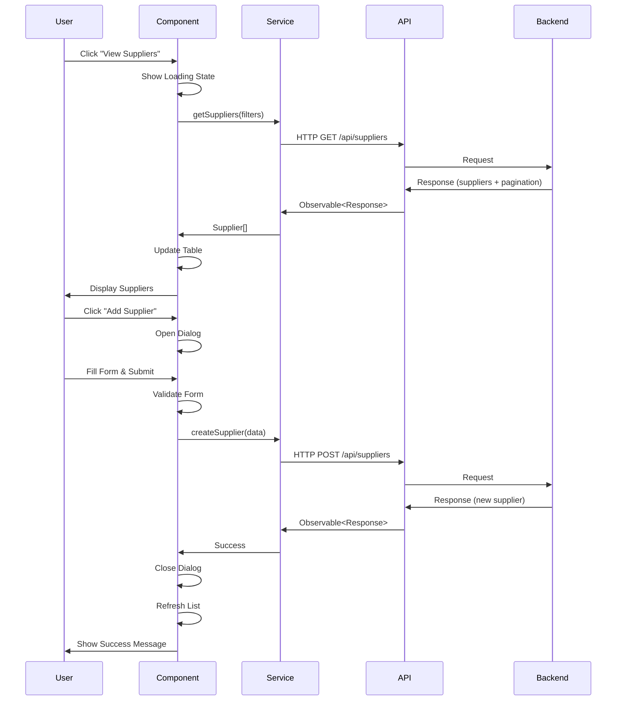

# Design Document

## Overview

This document outlines the technical design for implementing the Supplier Module frontend interface using Angular. The backend APIs are already fully implemented with 10 endpoints for supplier management. This design focuses on creating Angular components, services, models, and UI to provide a complete supplier management experience following the patterns established in the User module.

### Key Design Principles

1. **Consistency**: Follow existing patterns from the User module for component structure, service layer, and UI/UX
2. **Angular Material**: Use Material Design components for consistent look and feel
3. **Reactive Programming**: Leverage RxJS for state management and API calls
4. **Type Safety**: Use TypeScript interfaces for all data models
5. **Error Handling**: Provide user-friendly error messages and loading states
6. **Responsive Design**: Ensure the interface works on all screen sizes

## Architecture

### Frontend Architecture

```
┌─────────────────────────────────────────────────────────────┐
│                    Angular Application                       │
│                                                               │
│  ┌────────────────────────────────────────────────────────┐ │
│  │  Routing Module (app.routes.ts)                        │ │
│  │  - /suppliers route configuration                      │ │
│  │  - Auth guard protection                               │ │
│  └────────────────┬───────────────────────────────────────┘ │
│                   │                                          │
│  ┌────────────────▼───────────────────────────────────────┐ │
│  │  Supplier Feature Module                               │ │
│  │                                                         │ │
│  │  ┌──────────────────────────────────────────────────┐ │ │
│  │  │  Components                                       │ │ │
│  │  │  - SuppliersComponent (main list view)           │ │ │
│  │  │  - SupplierFormComponent (create/edit dialog)    │ │ │
│  │  │  - SupplierDetailComponent (detail view)         │ │ │
│  │  │  - SupplierStatsComponent (statistics cards)     │ │ │
│  │  └──────────────────────────────────────────────────┘ │ │
│  │                                                         │ │
│  │  ┌──────────────────────────────────────────────────┐ │ │
│  │  │  Services                                         │ │ │
│  │  │  - SupplierService (API communication)           │ │ │
│  │  └──────────────────────────────────────────────────┘ │ │
│  │                                                         │ │
│  │  ┌──────────────────────────────────────────────────┐ │ │
│  │  │  Models/Interfaces                                │ │ │
│  │  │  - Supplier interface                             │ │ │
│  │  │  - SupplierFormData interface                     │ │ │
│  │  │  - SupplierStatistics interface                   │ │ │
│  │  └──────────────────────────────────────────────────┘ │ │
│  └─────────────────────────────────────────────────────────┘ │
│                                                               │
│  ┌─────────────────────────────────────────────────────────┐ │
│  │  Shared Services                                         │ │
│  │  - HttpClient (API calls)                                │ │
│  │  - AuthService (authentication)                          │ │
│  │  - NotificationService (toasts/snackbars)                │ │
│  └─────────────────────────────────────────────────────────┘ │
└───────────────────────────────┬───────────────────────────────┘
                                │ HTTP
┌───────────────────────────────▼───────────────────────────────┐
│                     Backend REST API                           │
│  - GET /api/suppliers/statistics                               │
│  - GET /api/suppliers/type/:type                               │
│  - GET /api/suppliers/code/:code                               │
│  - GET /api/suppliers (with pagination)                        │
│  - POST /api/suppliers                                         │
│  - GET /api/suppliers/:id                                      │
│  - PUT /api/suppliers/:id                                      │
│  - DELETE /api/suppliers/:id                                   │
│  - POST /api/suppliers/:id/restore                             │
│  - PATCH /api/suppliers/:id/toggle-status                      │
└───────────────────────────────────────────────────────────────┘
```

### Component Interaction Flow



## Components and Interfaces

### 1. Routing Configuration

**File**: `Frontend/src/app/app.routes.ts`

**Implementation**:
```typescript
{
  path: 'suppliers',
  loadComponent: () => import('./features/suppliers/suppliers.component')
    .then(m => m.SuppliersComponent),
  canActivate: [authGuard]
}
```

### 2. Supplier Service

**File**: `Frontend/src/app/features/suppliers/services/supplier.service.ts`

**Responsibilities**:
- Communicate with backend APIs
- Handle HTTP requests and responses
- Transform data if needed
- Provide observables for components

**Methods**:
```typescript
class SupplierService {
  // List and filter
  getSuppliers(params: SupplierQueryParams): Observable<PaginatedResponse<Supplier>>
  getSuppliersByType(type: string): Observable<Supplier[]>
  getSupplierByCode(code: string): Observable<Supplier>
  getSupplierById(id: string): Observable<Supplier>
  
  // CRUD operations
  createSupplier(data: SupplierFormData): Observable<Supplier>
  updateSupplier(id: string, data: SupplierFormData): Observable<Supplier>
  deleteSupplier(id: string): Observable<void>
  restoreSupplier(id: string): Observable<Supplier>
  
  // Status and statistics
  toggleSupplierStatus(id: string): Observable<Supplier>
  getStatistics(): Observable<SupplierStatistics>
}
```

**Query Parameters Interface**:
```typescript
interface SupplierQueryParams {
  page?: number;
  limit?: number;
  type?: 'customer' | 'supplier' | 'both';
  isActive?: boolean;
  search?: string;
}
```

### 3. Main Suppliers Component

**File**: `Frontend/src/app/features/suppliers/suppliers.component.ts`

**Responsibilities**:
- Display supplier list in a table
- Handle pagination
- Provide search and filter controls
- Open create/edit dialogs
- Handle delete confirmations
- Display statistics (if user has permission)

**Component Structure**:
```typescript
@Component({
  selector: 'app-suppliers',
  standalone: true,
  imports: [
    CommonModule,
    MatTableModule,
    MatPaginatorModule,
    MatButtonModule,
    MatIconModule,
    MatInputModule,
    MatSelectModule,
    MatDialogModule,
    MatProgressSpinnerModule,
    // ... other Material modules
  ],
  templateUrl: './suppliers.component.html',
  styleUrl: './suppliers.component.scss'
})
export class SuppliersComponent implements OnInit {
  suppliers: Supplier[] = [];
  displayedColumns: string[] = ['code', 'name', 'type', 'phone', 'email', 'city', 'isActive', 'actions'];
  
  // Pagination
  totalItems = 0;
  pageSize = 10;
  currentPage = 1;
  pageSizeOptions = [10, 25, 50, 100];
  
  // Filters
  searchTerm = '';
  selectedType: string | null = null;
  selectedStatus: boolean | null = null;
  
  // State
  loading = false;
  error = '';
  
  // Statistics (for admin/accountant)
  statistics: SupplierStatistics | null = null;
  showStatistics = false;
  
  constructor(
    private supplierService: SupplierService,
    private dialog: MatDialog,
    private snackBar: MatSnackBar,
    private authService: AuthService
  ) {}
  
  ngOnInit(): void {
    this.checkPermissions();
    this.loadSuppliers();
    if (this.showStatistics) {
      this.loadStatistics();
    }
  }
  
  loadSuppliers(): void { /* ... */ }
  loadStatistics(): void { /* ... */ }
  onSearch(): void { /* ... */ }
  onFilterChange(): void { /* ... */ }
  onPageChange(event: PageEvent): void { /* ... */ }
  openCreateDialog(): void { /* ... */ }
  openEditDialog(supplier: Supplier): void { /* ... */ }
  openDetailDialog(supplier: Supplier): void { /* ... */ }
  confirmDelete(supplier: Supplier): void { /* ... */ }
  restoreSupplier(supplier: Supplier): void { /* ... */ }
  toggleStatus(supplier: Supplier): void { /* ... */ }
  checkPermissions(): void { /* ... */ }
}
```

**Template Structure** (`suppliers.component.html`):
```html
<div class="suppliers-container">
  <!-- Header -->
  <div class="header">
    <h1>Supplier Management</h1>
    <button mat-raised-button color="primary" (click)="openCreateDialog()" *ngIf="canCreate">
      <mat-icon>add</mat-icon>
      Add Supplier
    </button>
  </div>
  
  <!-- Statistics Cards (admin/accountant only) -->
  <div class="statistics" *ngIf="showStatistics && statistics">
    <mat-card>
      <mat-card-content>
        <div class="stat-value">{{ statistics.total }}</div>
        <div class="stat-label">Total Suppliers</div>
      </mat-card-content>
    </mat-card>
    <!-- More stat cards -->
  </div>
  
  <!-- Filters -->
  <div class="filters">
    <mat-form-field>
      <mat-label>Search</mat-label>
      <input matInput [(ngModel)]="searchTerm" (keyup.enter)="onSearch()" placeholder="Search by name or code">
      <mat-icon matSuffix>search</mat-icon>
    </mat-form-field>
    
    <mat-form-field>
      <mat-label>Type</mat-label>
      <mat-select [(ngModel)]="selectedType" (selectionChange)="onFilterChange()">
        <mat-option [value]="null">All</mat-option>
        <mat-option value="customer">Customer</mat-option>
        <mat-option value="supplier">Supplier</mat-option>
        <mat-option value="both">Both</mat-option>
      </mat-select>
    </mat-form-field>
    
    <mat-form-field>
      <mat-label>Status</mat-label>
      <mat-select [(ngModel)]="selectedStatus" (selectionChange)="onFilterChange()">
        <mat-option [value]="null">All</mat-option>
        <mat-option [value]="true">Active</mat-option>
        <mat-option [value]="false">Inactive</mat-option>
      </mat-select>
    </mat-form-field>
  </div>
  
  <!-- Loading Spinner -->
  <div class="loading" *ngIf="loading">
    <mat-spinner></mat-spinner>
  </div>
  
  <!-- Error Message -->
  <div class="error" *ngIf="error">
    <mat-error>{{ error }}</mat-error>
  </div>
  
  <!-- Suppliers Table -->
  <div class="table-container" *ngIf="!loading && !error">
    <table mat-table [dataSource]="suppliers" class="suppliers-table">
      <!-- Code Column -->
      <ng-container matColumnDef="code">
        <th mat-header-cell *matHeaderCellDef>Code</th>
        <td mat-cell *matCellDef="let supplier">{{ supplier.code }}</td>
      </ng-container>
      
      <!-- Name Column -->
      <ng-container matColumnDef="name">
        <th mat-header-cell *matHeaderCellDef>Name</th>
        <td mat-cell *matCellDef="let supplier">{{ supplier.name }}</td>
      </ng-container>
      
      <!-- Type Column -->
      <ng-container matColumnDef="type">
        <th mat-header-cell *matHeaderCellDef>Type</th>
        <td mat-cell *matCellDef="let supplier">
          <mat-chip>{{ supplier.type }}</mat-chip>
        </td>
      </ng-container>
      
      <!-- Contact Columns -->
      <ng-container matColumnDef="phone">
        <th mat-header-cell *matHeaderCellDef>Phone</th>
        <td mat-cell *matCellDef="let supplier">{{ supplier.contactInfo?.phone || '-' }}</td>
      </ng-container>
      
      <ng-container matColumnDef="email">
        <th mat-header-cell *matHeaderCellDef>Email</th>
        <td mat-cell *matCellDef="let supplier">{{ supplier.contactInfo?.email || '-' }}</td>
      </ng-container>
      
      <ng-container matColumnDef="city">
        <th mat-header-cell *matHeaderCellDef>City</th>
        <td mat-cell *matCellDef="let supplier">{{ supplier.contactInfo?.city || '-' }}</td>
      </ng-container>
      
      <!-- Status Column -->
      <ng-container matColumnDef="isActive">
        <th mat-header-cell *matHeaderCellDef>Status</th>
        <td mat-cell *matCellDef="let supplier">
          <mat-slide-toggle 
            [checked]="supplier.isActive" 
            (change)="toggleStatus(supplier)"
            *ngIf="canToggleStatus">
          </mat-slide-toggle>
          <mat-chip [color]="supplier.isActive ? 'primary' : 'warn'" *ngIf="!canToggleStatus">
            {{ supplier.isActive ? 'Active' : 'Inactive' }}
          </mat-chip>
        </td>
      </ng-container>
      
      <!-- Actions Column -->
      <ng-container matColumnDef="actions">
        <th mat-header-cell *matHeaderCellDef>Actions</th>
        <td mat-cell *matCellDef="let supplier">
          <button mat-icon-button (click)="openDetailDialog(supplier)" matTooltip="View Details">
            <mat-icon>visibility</mat-icon>
          </button>
          <button mat-icon-button (click)="openEditDialog(supplier)" *ngIf="canEdit" matTooltip="Edit">
            <mat-icon>edit</mat-icon>
          </button>
          <button mat-icon-button (click)="confirmDelete(supplier)" *ngIf="canDelete && supplier.isActive" matTooltip="Delete">
            <mat-icon>delete</mat-icon>
          </button>
          <button mat-icon-button (click)="restoreSupplier(supplier)" *ngIf="canRestore && !supplier.isActive" matTooltip="Restore">
            <mat-icon>restore</mat-icon>
          </button>
        </td>
      </ng-container>
      
      <tr mat-header-row *matHeaderRowDef="displayedColumns"></tr>
      <tr mat-row *matRowDef="let row; columns: displayedColumns;"></tr>
    </table>
    
    <!-- Paginator -->
    <mat-paginator 
      [length]="totalItems"
      [pageSize]="pageSize"
      [pageSizeOptions]="pageSizeOptions"
      (page)="onPageChange($event)">
    </mat-paginator>
  </div>
</div>
```

### 4. Supplier Form Component (Dialog)

**File**: `Frontend/src/app/features/suppliers/components/supplier-form/supplier-form.component.ts`

**Responsibilities**:
- Display form for creating/editing suppliers
- Validate form inputs
- Submit data to service
- Handle errors

**Component Structure**:
```typescript
@Component({
  selector: 'app-supplier-form',
  standalone: true,
  imports: [
    CommonModule,
    ReactiveFormsModule,
    MatDialogModule,
    MatFormFieldModule,
    MatInputModule,
    MatSelectModule,
    MatButtonModule,
    // ... other Material modules
  ],
  templateUrl: './supplier-form.component.html',
  styleUrl: './supplier-form.component.scss'
})
export class SupplierFormComponent implements OnInit {
  supplierForm: FormGroup;
  isEditMode = false;
  loading = false;
  
  types = ['customer', 'supplier', 'both'];
  currencies = ['PKR', 'USD', 'EUR'];
  advanceTaxRates = [0, 0.5, 2.5];
  
  constructor(
    private fb: FormBuilder,
    private dialogRef: MatDialogRef<SupplierFormComponent>,
    @Inject(MAT_DIALOG_DATA) public data: { supplier?: Supplier },
    private supplierService: SupplierService,
    private snackBar: MatSnackBar
  ) {
    this.supplierForm = this.createForm();
  }
  
  ngOnInit(): void {
    if (this.data?.supplier) {
      this.isEditMode = true;
      this.populateForm(this.data.supplier);
    }
  }
  
  createForm(): FormGroup {
    return this.fb.group({
      code: [''],
      name: ['', [Validators.required, Validators.minLength(2), Validators.maxLength(200)]],
      type: ['supplier', Validators.required],
      contactInfo: this.fb.group({
        phone: ['', Validators.maxLength(20)],
        email: ['', [Validators.email]],
        address: ['', Validators.maxLength(500)],
        city: ['', Validators.maxLength(100)],
        country: ['Pakistan', Validators.maxLength(100)]
      }),
      financialInfo: this.fb.group({
        creditLimit: [0, [Validators.min(0)]],
        paymentTerms: [30, [Validators.min(0), Validators.max(365)]],
        taxNumber: ['', Validators.maxLength(50)],
        licenseNo: ['', Validators.maxLength(50)],
        srbNo: ['', Validators.maxLength(50)],
        ntn: ['', Validators.maxLength(50)],
        strn: ['', Validators.maxLength(50)],
        nicNumber: ['', Validators.maxLength(20)],
        whtPercent: [0, [Validators.min(0), Validators.max(100)]],
        creditDays: [0, [Validators.min(0), Validators.max(365)]],
        currency: ['PKR'],
        advanceTaxRate: [0],
        isNonFiler: [false]
      }),
      route: ['', Validators.maxLength(100)]
    });
  }
  
  populateForm(supplier: Supplier): void { /* ... */ }
  
  onSubmit(): void {
    if (this.supplierForm.invalid) {
      this.supplierForm.markAllAsTouched();
      return;
    }
    
    this.loading = true;
    const formData = this.supplierForm.value;
    
    const operation = this.isEditMode
      ? this.supplierService.updateSupplier(this.data.supplier!._id, formData)
      : this.supplierService.createSupplier(formData);
    
    operation.subscribe({
      next: (supplier) => {
        this.snackBar.open(
          `Supplier ${this.isEditMode ? 'updated' : 'created'} successfully`,
          'Close',
          { duration: 3000 }
        );
        this.dialogRef.close(supplier);
      },
      error: (error) => {
        this.loading = false;
        this.snackBar.open(
          error.error?.error?.message || 'Operation failed',
          'Close',
          { duration: 5000 }
        );
      }
    });
  }
  
  onCancel(): void {
    this.dialogRef.close();
  }
}
```

### 5. Supplier Detail Component (Dialog)

**File**: `Frontend/src/app/features/suppliers/components/supplier-detail/supplier-detail.component.ts`

**Responsibilities**:
- Display all supplier information in a read-only view
- Provide edit and delete actions

**Component Structure**:
```typescript
@Component({
  selector: 'app-supplier-detail',
  standalone: true,
  imports: [
    CommonModule,
    MatDialogModule,
    MatButtonModule,
    MatIconModule,
    MatTabsModule,
    // ... other Material modules
  ],
  templateUrl: './supplier-detail.component.html',
  styleUrl: './supplier-detail.component.scss'
})
export class SupplierDetailComponent {
  constructor(
    @Inject(MAT_DIALOG_DATA) public supplier: Supplier,
    private dialogRef: MatDialogRef<SupplierDetailComponent>
  ) {}
  
  onEdit(): void {
    this.dialogRef.close({ action: 'edit', supplier: this.supplier });
  }
  
  onDelete(): void {
    this.dialogRef.close({ action: 'delete', supplier: this.supplier });
  }
  
  onClose(): void {
    this.dialogRef.close();
  }
}
```

## Data Models

### TypeScript Interfaces

**File**: `Frontend/src/app/features/suppliers/models/supplier.model.ts`

```typescript
export interface Supplier {
  _id: string;
  code: string;
  name: string;
  type: 'customer' | 'supplier' | 'both';
  contactInfo: ContactInfo;
  financialInfo: FinancialInfo;
  route?: string;
  isActive: boolean;
  createdAt: string;
  updatedAt: string;
}

export interface ContactInfo {
  phone?: string;
  email?: string;
  address?: string;
  city?: string;
  country?: string;
}

export interface FinancialInfo {
  creditLimit: number;
  paymentTerms: number;
  taxNumber?: string;
  licenseNo?: string;
  srbNo?: string;
  ntn?: string;
  strn?: string;
  nicNumber?: string;
  whtPercent: number;
  creditDays: number;
  currency: string;
  advanceTaxRate: 0 | 0.5 | 2.5;
  isNonFiler: boolean;
}

export interface SupplierFormData {
  code?: string;
  name: string;
  type: 'customer' | 'supplier' | 'both';
  contactInfo?: Partial<ContactInfo>;
  financialInfo?: Partial<FinancialInfo>;
  route?: string;
}

export interface SupplierStatistics {
  total: number;
  active: number;
  inactive: number;
  byType: {
    customer: number;
    supplier: number;
    both: number;
  };
  totalCreditLimit?: number;
  averagePaymentTerms?: number;
}

export interface PaginatedResponse<T> {
  success: boolean;
  data: T[];
  pagination: {
    totalItems: number;
    totalPages: number;
    currentPage: number;
    itemsPerPage: number;
    hasNextPage: boolean;
    hasPreviousPage: boolean;
    nextPage: number | null;
    previousPage: number | null;
  };
  message: string;
  timestamp: string;
}

export interface ApiResponse<T> {
  success: boolean;
  data: T;
  message: string;
  timestamp: string;
}

export interface ApiError {
  success: false;
  error: {
    code: string;
    message: string;
  };
  timestamp: string;
}
```

## Error Handling

### Error Handling Strategy

1. **HTTP Errors**: Catch and display user-friendly messages
2. **Validation Errors**: Show field-level errors in forms
3. **Network Errors**: Display connection error messages
4. **Permission Errors**: Hide unauthorized actions, show appropriate messages

### Error Display

- Use MatSnackBar for temporary error notifications
- Display inline errors in forms
- Show error state in table when data fails to load
- Provide retry options for failed operations

### Example Error Handling

```typescript
this.supplierService.getSuppliers(params).subscribe({
  next: (response) => {
    this.suppliers = response.data;
    this.totalItems = response.pagination.totalItems;
    this.loading = false;
  },
  error: (error) => {
    this.loading = false;
    this.error = error.error?.error?.message || 'Failed to load suppliers';
    this.snackBar.open(this.error, 'Close', { duration: 5000 });
  }
});
```

## Testing Strategy

### Unit Testing

**Component Tests**:
- Test component initialization
- Test form validation
- Test user interactions (button clicks, form submissions)
- Test data binding
- Mock service calls

**Service Tests**:
- Test HTTP requests
- Test error handling
- Test data transformation
- Mock HttpClient

### Integration Testing

- Test component-service integration
- Test routing navigation
- Test dialog interactions
- Test permission-based UI rendering

### E2E Testing

- Test complete user flows
- Test create supplier flow
- Test edit supplier flow
- Test delete and restore flows
- Test search and filter functionality

## Implementation Notes

### File Structure

```
Frontend/src/app/features/suppliers/
├── components/
│   ├── supplier-form/
│   │   ├── supplier-form.component.ts
│   │   ├── supplier-form.component.html
│   │   └── supplier-form.component.scss
│   ├── supplier-detail/
│   │   ├── supplier-detail.component.ts
│   │   ├── supplier-detail.component.html
│   │   └── supplier-detail.component.scss
│   └── supplier-stats/
│       ├── supplier-stats.component.ts
│       ├── supplier-stats.component.html
│       └── supplier-stats.component.scss
├── services/
│   └── supplier.service.ts
├── models/
│   └── supplier.model.ts
├── suppliers.component.ts
├── suppliers.component.html
└── suppliers.component.scss
```

### Angular Material Modules Needed

- MatTableModule
- MatPaginatorModule
- MatSortModule
- MatFormFieldModule
- MatInputModule
- MatSelectModule
- MatButtonModule
- MatIconModule
- MatDialogModule
- MatSnackBarModule
- MatProgressSpinnerModule
- MatChipsModule
- MatSlideToggleModule
- MatTooltipModule
- MatCardModule
- MatTabsModule

### Styling Considerations

- Follow Material Design guidelines
- Use consistent spacing and colors
- Make tables responsive (consider mobile view)
- Use loading skeletons for better UX
- Implement smooth transitions

### Performance Considerations

- Implement virtual scrolling for large lists
- Use OnPush change detection strategy
- Lazy load the supplier module
- Cache statistics data
- Debounce search input

### Accessibility

- Add ARIA labels to buttons and inputs
- Ensure keyboard navigation works
- Provide screen reader support
- Use semantic HTML
- Maintain proper color contrast

## Design Decisions and Rationale

### 1. Standalone Components
**Decision**: Use standalone components instead of NgModule
**Rationale**: Modern Angular best practice, better tree-shaking, simpler imports

### 2. Reactive Forms
**Decision**: Use ReactiveFormsModule for forms
**Rationale**: Better validation control, easier testing, type safety

### 3. Dialog for Forms
**Decision**: Use MatDialog for create/edit forms
**Rationale**: Keeps user context, follows Material Design patterns, better UX

### 4. Service Layer
**Decision**: Separate service for API communication
**Rationale**: Reusability, testability, separation of concerns

### 5. Permission-Based UI
**Decision**: Hide/show actions based on user role
**Rationale**: Better UX than showing disabled buttons, security through obscurity

### 6. Pagination
**Decision**: Server-side pagination
**Rationale**: Better performance with large datasets, consistent with backend implementation

### 7. Optimistic UI Updates
**Decision**: Update UI immediately for toggle actions
**Rationale**: Better perceived performance, revert on error

### 8. Statistics Dashboard
**Decision**: Show statistics only to admin/accountant
**Rationale**: Follows backend permission model, reduces unnecessary API calls
